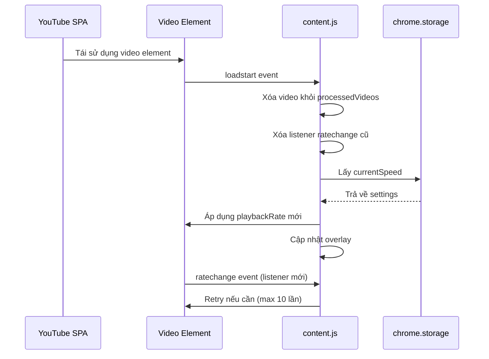

# Video Speed Controller - Sửa Bug Desync Tốc độ trên YouTube SPA

## Giai đoạn 0: Làm rõ đầu vào

### Bối cảnh vấn đề
- **Dự án:** Video Speed Controller Chrome Extension (MV3)
- **Bug:** Khi phát video ở tốc độ 2x và điều hướng đến video mới trên YouTube (SPA), overlay hiển thị 2x nhưng tốc độ thực tế là 1x
- **Nguyên nhân gốc:** YouTube SPA tái sử dụng cùng một phần tử `<video>` khi điều hướng. MutationObserver không kích hoạt (chỉ quan sát `childList`), `handleNewVideo()` trả về sớm vì video đã trong `processedVideos` WeakSet, tốc độ không được áp dụng lại
- **Giải pháp đề xuất:** Sử dụng sự kiện `loadstart` để phát hiện khi phần tử video tải nội dung mới

### Thông tin dự án
- **Ngôn ngữ:** JavaScript (Chrome Extension MV3)
- **Codebase:** Hiện có
- **Phạm vi:** Single file (`content/content.js`)
- **Loại:** Fix bug
- **Môi trường:** Chrome Extension
- **Tệp chính:** `content/content.js`, `config/defaults.js`, `background/service_worker.js`

---

## Giai đoạn 1: Phân tích yêu cầu

### Yêu cầu theo EARS (Executable Requirements Specification)

**Yêu cầu 1 - Phát hiện tái sử dụng video:**
- KHI phần tử `<video>` được tái sử dụng bởi YouTube SPA (sự kiện `loadstart` kích hoạt)
- HỆ THỐNG PHẢI xóa video khỏi `processedVideos` WeakSet
- ĐỂ cho phép `handleNewVideo()` xử lý lại video

**Yêu cầu 2 - Áp dụng lại tốc độ:**
- KHI sự kiện `loadstart` kích hoạt trên video
- HỆ THỐNG PHẢI áp dụng tốc độ hiện tại từ storage
- ĐỂ đảm bảo video mới có tốc độ chính xác

**Yêu cầu 3 - Cập nhật overlay:**
- KHI tốc độ được áp dụng lại sau `loadstart`
- HỆ THỐNG PHẢI cập nhật overlay để hiển thị tốc độ chính xác
- ĐỂ người dùng thấy tốc độ đúng trên giao diện

**Yêu cầu 4 - Tránh xung đột listener:**
- KHI `loadstart` kích hoạt
- HỆ THỐNG PHẢI xóa listener `ratechange` cũ trước khi thêm listener mới
- ĐỂ tránh retry logic bị gọi nhiều lần

**Yêu cầu 5 - Xử lý autoApply = false:**
- KHI `autoApply` được tắt
- HỆ THỐNG PHẢI chỉ cập nhật overlay, không áp dụng tốc độ
- ĐỂ tôn trọng cài đặt người dùng

### Kết quả nghiên cứu Codebase

**Cấu trúc hiện tại:**
- `processedVideos` (WeakSet): Lưu trữ các video đã được xử lý
- `videoOverlayMap` (WeakMap): Lưu trữ overlay cho mỗi video
- `applySpeedToVideo()`: Áp dụng tốc độ, tạo overlay, thêm listener `ratechange`
- `handleNewVideo()`: Kiểm tra `processedVideos`, gọi `applySpeedToVideo()` nếu `autoApply = true`
- `initMutationObserver()`: Quan sát `childList` để phát hiện video mới (không hoạt động cho SPA)
- `initStorageListener()`: Lắng nghe thay đổi storage, áp dụng tốc độ cho tất cả video

**Vấn đề hiện tại:**
- MutationObserver không kích hoạt khi video element tái sử dụng (không có DOM node mới)
- `handleNewVideo()` trả về sớm vì video đã trong `processedVideos`
- `applySpeedToVideo()` không được gọi lại
- Overlay không được cập nhật
- Listener `ratechange` cũ đã bị xóa (tốc độ đã ổn định)

**Giải pháp:**
- Thêm listener `loadstart` trong `applySpeedToVideo()` để phát hiện tái sử dụng
- Xóa video khỏi `processedVideos` trong `loadstart` handler
- Xóa listener `ratechange` cũ trước khi thêm listener mới
- Áp dụng tốc độ mới từ storage
- Cập nhật overlay

### Kết quả nghiên cứu Web

**Sự kiện `loadstart` trong HTML5 video:**
- Kích hoạt khi video element bắt đầu tải nội dung mới
- Kích hoạt một lần duy nhất khi nội dung mới được gán (thông qua `src` attribute hoặc `<source>` tag)
- Hoàn hảo cho phát hiện tái sử dụng video element trong SPA
- Không có overhead polling, không có false positive

---

## Giai đoạn 2: Đặc tả giải pháp

### Kiến trúc giải pháp

**Thành phần chính:**
1. **Listener `loadstart`** - Phát hiện khi video tải nội dung mới
2. **Reset `processedVideos`** - Xóa video khỏi WeakSet để cho phép xử lý lại
3. **Xóa listener `ratechange` cũ** - Tránh xung đột với retry logic cũ
4. **Áp dụng tốc độ mới** - Gọi `applySpeedToVideo()` với tốc độ từ storage

**Luồng xử lý:**
```
YouTube SPA tái sử dụng video element
    ↓
loadstart event kích hoạt
    ↓
Xóa video khỏi processedVideos
    ↓
Xóa listener ratechange cũ
    ↓
Lấy currentSpeed từ storage
    ↓
Áp dụng playbackRate mới
    ↓
Cập nhật overlay
    ↓
Thêm listener ratechange mới (retry logic)
```

### Sơ đồ luồng (Mermaid)



### Bảng đánh đổi (Trade-off Analysis)

| Approach | Ưu điểm | Nhược điểm | Độ phức tạp | Bảo mật | Khuyến nghị |
|----------|---------|-----------|------------|--------|-----------|
| **Sử dụng `loadstart` event** | Phát hiện chính xác khi video tái sử dụng; không cần polling; hiệu suất tốt; tiêu chuẩn HTML5 | Phải xóa listener cũ; phải reset WeakSet | Thấp | Cao | ✅ **CHỌN** |
| Polling `playbackRate` mỗi 100ms | Đơn giản; không cần event listener | Tiêu tốn CPU; không chính xác; có độ trễ; không phải tiêu chuẩn | Trung bình | Thấp | ❌ |
| Sử dụng `play` event | Kích hoạt khi video phát | Kích hoạt quá nhiều lần; không phải lúc tải nội dung mới; false positive | Thấp | Cao | ❌ |
| Sử dụng `seeking` event | Phát hiện khi người dùng tìm kiếm | Không phát hiện tái sử dụng; quá nhiều false positive | Thấp | Cao | ❌ |

**Lý do chọn `loadstart`:**
- Đây là sự kiện tiêu chuẩn HTML5 được thiết kế chính xác cho trường hợp này
- Khi video element tái sử dụng, `loadstart` kích hoạt một lần duy nhất khi nội dung mới bắt đầu tải
- Không có overhead polling, không có false positive
- Hiệu suất tốt, không ảnh hưởng đến trải nghiệm người dùng

### Bảng Edge Cases

| Edge Case | Điều kiện kích hoạt | Hành vi mong đợi | Tác động nếu bỏ qua |
|-----------|-------------------|-------------------|-------------------|
| Video không có src | `loadstart` kích hoạt nhưng video không có src | Bỏ qua, không áp dụng tốc độ | Lỗi không nghiêm trọng |
| Video bị xóa khỏi DOM | `loadstart` kích hoạt nhưng video bị xóa | Listener vẫn hoạt động, không ảnh hưởng | Rò rỉ bộ nhớ nhỏ (WeakSet tự dọn) |
| Người dùng tắt autoApply | `loadstart` kích hoạt nhưng autoApply = false | Chỉ cập nhật overlay, không áp dụng tốc độ | Hành vi không nhất quán |
| Nhiều video trên cùng trang | `loadstart` kích hoạt trên video khác | Mỗi video được xử lý độc lập | Không có vấn đề |
| Storage chưa sẵn sàng | `loadstart` kích hoạt trước khi storage load | Sử dụng DEFAULTS fallback | Tốc độ mặc định được áp dụng |
| Listener `loadstart` được thêm nhiều lần | Gọi `applySpeedToVideo()` nhiều lần trên cùng video | Listener được thêm nhiều lần, handler kích hoạt nhiều lần | Tốc độ được áp dụng nhiều lần (idempotent) |

### Bảng xử lý ngoại lệ (Exception Handling)

| Loại ngoại lệ | Nguồn | Chiến lược xử lý | Tác động người dùng | Hành động phục hồi |
|----------------|--------|-----------------|-------------------|-------------------|
| Storage read error | `chrome.storage.sync.get()` | Catch error, sử dụng DEFAULTS | Tốc độ mặc định được áp dụng | Không cần retry |
| Video element removed | DOM manipulation | Check `video.isConnected` trước khi set playbackRate | Không có lỗi, overlay không cập nhật | Bỏ qua video |
| Invalid playbackRate | Browser API | Clamp speed trong `clampSpeed()` | Tốc độ được giới hạn trong phạm vi hợp lệ | Không cần retry |
| Listener attachment error | Event listener | Try-catch trong `applySpeedToVideo()` | Log error, video vẫn phát | Không cần retry |
| `loadstart` handler error | Event handler | Try-catch trong handler | Log error, video vẫn phát | Không cần retry |

### Bảng Race Conditions & Concurrency

| Tài nguyên chia sẻ | Kịch bản truy cập đồng thời | Rủi ro | Chiến lược giảm thiểu |
|------------------|---------------------------|--------|----------------------|
| `processedVideos` WeakSet | `loadstart` + `handleNewVideo()` gọi cùng lúc | Video được xử lý 2 lần | Xóa video khỏi WeakSet trong `loadstart` handler trước khi gọi `applySpeedToVideo()` |
| `videoOverlayMap` WeakMap | Nhiều video cùng cập nhật overlay | Overlay bị ghi đè | Mỗi video có overlay riêng, không chia sẻ |
| `ratechange` listener | Listener cũ + listener mới cùng kích hoạt | Retry logic chạy 2 lần | Xóa listener cũ trước khi thêm listener mới trong `loadstart` handler |
| Storage listener + `loadstart` | Cả hai cùng cập nhật tốc độ | Tốc độ được áp dụng 2 lần | Không có vấn đề, idempotent operation |

**Chiến lược:**
- Sử dụng WeakSet/WeakMap để tự động dọn dẹp khi video bị xóa
- Xóa listener cũ trước khi thêm listener mới
- Tất cả operation là idempotent (áp dụng nhiều lần không gây hại)

---

## Giai đoạn 3: Kế hoạch triển khai

### Phân loại yêu cầu
- **Loại:** Fix Bugs
- **Workflow:** DEBUG/FIX (5 giai đoạn)
- **Phạm vi:** Single file (`content/content.js`)

### Workflow DEBUG/FIX

1. **Information Gathering** ✅ (Hoàn thành)
2. **Root Cause Analysis** ✅ (Hoàn thành - YouTube SPA reuse video element)
3. **Solution Design** ✅ (Hoàn thành - Sử dụng `loadstart` event)
4. **Fix Implementation** (Sắp tới)
5. **Verification** (Sắp tới)

### Cây task chi tiết

```
ROOT: Fix Bug - Speed Desync trên YouTube SPA
├── PHASE 1: Information Gathering (COMPLETED)
├── PHASE 2: Root Cause Analysis (COMPLETED)
├── PHASE 3: Solution Design (COMPLETED)
├── PHASE 4: Fix Implementation
│   ├── Task 4.1: Thêm loadstart listener vào applySpeedToVideo()
│   ├── Task 4.2: Xóa video khỏi processedVideos trong loadstart handler
│   ├── Task 4.3: Xóa listener ratechange cũ trước khi thêm listener mới
│   ├── Task 4.4: Cập nhật overlay sau khi áp dụng tốc độ
│   └── Task 4.5: Xử lý edge case - autoApply = false
└── PHASE 5: Verification
    ├── Task 5.1: Build & Lint
    ├── Task 5.2: Manual test trên YouTube SPA
    ├── Task 5.3: Regression test - tốc độ bình thường
    └── Task 5.4: Regression test - overlay toggle
```

### Chi tiết từng task

#### Task 4.1: Thêm loadstart listener vào applySpeedToVideo()

**Mục tiêu:** Phát hiện khi video tái sử dụng

**Files:** `content/content.js`

**Thay đổi tối thiểu:**
- Thêm listener `loadstart` trong `applySpeedToVideo()` sau khi thêm listener `ratechange`
- Handler `loadstart` sẽ xóa video khỏi `processedVideos` và áp dụng tốc độ mới

**Lệnh kiểm tra:**
```bash
grep -n "addEventListener('loadstart'" content/content.js
```

**Kết quả mong đợi:** Listener được đăng ký thành công, grep trả về dòng chứa `addEventListener('loadstart'`

**Ghi chú rollback:** Xóa listener `loadstart` handler

---

#### Task 4.2: Xóa video khỏi processedVideos trong loadstart handler

**Mục tiêu:** Cho phép `handleNewVideo()` xử lý lại video

**Files:** `content/content.js`

**Thay đổi tối thiểu:**
- Gọi `processedVideos.delete(video)` trong loadstart handler
- Điều này cho phép `handleNewVideo()` xử lý video lại khi `loadstart` kích hoạt

**Lệnh kiểm tra:**
```bash
grep -n "processedVideos.delete(video)" content/content.js
```

**Kết quả mong đợi:** Grep trả về dòng chứa `processedVideos.delete(video)`

**Ghi chú rollback:** Xóa dòng `processedVideos.delete(video)`

---

#### Task 4.3: Xóa listener ratechange cũ trước khi thêm listener mới

**Mục tiêu:** Tránh xung đột retry logic

**Files:** `content/content.js`

**Thay đổi tối thiểu:**
- Lưu reference đến `handleRateChange` để có thể xóa sau
- Trong loadstart handler, xóa listener cũ: `video.removeEventListener('ratechange', handleRateChange)`
- Thêm listener mới sau khi xóa listener cũ

**Lệnh kiểm tra:**
```bash
grep -n "removeEventListener('ratechange'" content/content.js
```

**Kết quả mong đợi:** Grep trả về dòng chứa `removeEventListener('ratechange'`

**Ghi chú rollback:** Khôi phục cách xử lý listener cũ

---

#### Task 4.4: Cập nhật overlay sau khi áp dụng tốc độ

**Mục tiêu:** Overlay hiển thị tốc độ chính xác

**Files:** `content/content.js`

**Thay đổi tối thiểu:**
- Gọi `updateOverlay(video, clampedSpeed, settings)` trong loadstart handler
- Điều này cập nhật overlay để hiển thị tốc độ mới

**Lệnh kiểm tra:**
```bash
grep -n "updateOverlay(video" content/content.js | grep -i loadstart
```

**Kết quả mong đợi:** Grep trả về dòng chứa `updateOverlay(video` trong loadstart handler

**Ghi chú rollback:** Xóa dòng `updateOverlay()`

---

#### Task 4.5: Xử lý edge case - autoApply = false

**Mục tiêu:** Chỉ cập nhật overlay khi autoApply = false

**Files:** `content/content.js`

**Thay đổi tối thiểu:**
- Kiểm tra `settings.autoApply` trước khi áp dụng tốc độ trong loadstart handler
- Nếu `autoApply = false`, chỉ cập nhật overlay, không áp dụng tốc độ

**Lệnh kiểm tra:**
```bash
grep -n "if (settings.autoApply)" content/content.js
```

**Kết quả mong đợi:** Grep trả về dòng chứa điều kiện kiểm tra `autoApply`

**Ghi chú rollback:** Xóa điều kiện kiểm tra

---

### Verification Tasks

#### Task 5.1: Build & Lint

**Mục tiêu:** Đảm bảo code không có lỗi cú pháp

**Lệnh:**
```bash
# Kiểm tra cú pháp JavaScript
node -c content/content.js
```

**Kết quả mong đợi:** Không có lỗi cú pháp

---

#### Task 5.2: Manual test trên YouTube SPA

**Mục tiêu:** Xác minh bug được sửa

**Bước:**
1. Mở YouTube trong Chrome
2. Phát video bất kỳ
3. Nhấn D để tăng tốc độ lên 2x
4. Kiểm tra overlay hiển thị 2x
5. Điều hướng đến video khác (click vào video khác)
6. Kiểm tra overlay vẫn hiển thị 2x
7. Kiểm tra video phát ở tốc độ 2x (không phải 1x)

**Kết quả mong đợi:**
- Overlay hiển thị 2x
- Video phát ở tốc độ 2x
- Không có lỗi trong console

---

#### Task 5.3: Regression test - tốc độ bình thường

**Mục tiêu:** Đảm bảo tốc độ bình thường vẫn hoạt động

**Bước:**
1. Mở YouTube trong Chrome
2. Phát video bất kỳ
3. Nhấn R để reset tốc độ về 1x
4. Kiểm tra overlay hiển thị 1x
5. Kiểm tra video phát ở tốc độ 1x

**Kết quả mong đợi:**
- Overlay hiển thị 1x
- Video phát ở tốc độ 1x

---

#### Task 5.4: Regression test - overlay toggle

**Mục tiêu:** Đảm bảo toggle overlay vẫn hoạt động

**Bước:**
1. Mở YouTube trong Chrome
2. Phát video bất kỳ
3. Nhấn V để ẩn overlay
4. Kiểm tra overlay bị ẩn
5. Nhấn V để hiển thị overlay
6. Kiểm tra overlay hiển thị lại

**Kết quả mong đợi:**
- Overlay được ẩn/hiển thị chính xác

---

### Ma trận truy vết (Traceability Matrix)

| EARS Requirement | Task | Verification |
|------------------|------|--------------|
| Phát hiện tái sử dụng video | 4.1, 4.2 | Task 5.2 - Manual test YouTube SPA |
| Áp dụng lại tốc độ | 4.1, 4.3 | Task 5.2 - Kiểm tra playbackRate = 2x |
| Cập nhật overlay | 4.4 | Task 5.2 - Overlay hiển thị 2x |
| Tránh xung đột listener | 4.3 | Task 5.2 - Không có retry logic chạy 2 lần |
| Xử lý autoApply = false | 4.5 | Task 5.2 - Overlay cập nhật, tốc độ không áp dụng |

---

## Tóm tắt

### Vấn đề
YouTube SPA tái sử dụng phần tử `<video>` khi điều hướng, nhưng extension không phát hiện được điều này vì MutationObserver chỉ quan sát `childList`. Kết quả là overlay hiển thị 2x nhưng tốc độ thực tế là 1x.

### Giải pháp
Thêm listener `loadstart` để phát hiện khi video tải nội dung mới. Khi `loadstart` kích hoạt:
1. Xóa video khỏi `processedVideos` WeakSet
2. Xóa listener `ratechange` cũ
3. Áp dụng tốc độ mới từ storage
4. Cập nhật overlay

### Tác động
- **Người dùng:** Bug được sửa, tốc độ hiển thị chính xác trên YouTube SPA
- **Codebase:** Thêm ~20 dòng code, không thay đổi kiến trúc hiện tại
- **Hiệu suất:** Không ảnh hưởng, sử dụng event listener tiêu chuẩn

### Rủi ro
- **Thấp:** Giải pháp sử dụng sự kiện tiêu chuẩn HTML5, không có hack hoặc workaround
- **Regression:** Thấp, chỉ thêm listener mới, không thay đổi logic hiện tại

---

## Phụ lục: Pseudo-code

```javascript
// Trong applySpeedToVideo()
function applySpeedToVideo(video, speed, settings) {
  try {
    const clampedSpeed = clampSpeed(speed);
    video.playbackRate = clampedSpeed;
    updateOverlay(video, clampedSpeed, settings);
    processedVideos.add(video);

    let retryCount = 0;
    const maxRetries = 10;

    // Lưu reference để có thể xóa sau
    const handleRateChange = () => {
      if (Math.abs(video.playbackRate - clampedSpeed) > 0.01) {
        retryCount++;
        if (retryCount <= maxRetries) {
          video.playbackRate = clampedSpeed;
        } else {
          video.removeEventListener('ratechange', handleRateChange);
        }
      } else {
        video.removeEventListener('ratechange', handleRateChange);
      }
    };

    video.addEventListener('ratechange', handleRateChange);

    // ===== THÊMỚI: Listener loadstart =====
    const handleLoadStart = () => {
      try {
        // Xóa video khỏi processedVideos để cho phép xử lý lại
        processedVideos.delete(video);

        // Xóa listener ratechange cũ
        video.removeEventListener('ratechange', handleRateChange);

        // Lấy settings mới nhất
        chrome.storage.sync.get(DEFAULTS, (newSettings) => {
          if (settings.autoApply) {
            // Áp dụng tốc độ mới
            video.playbackRate = clampSpeed(newSettings.currentSpeed);

            // Cập nhật overlay
            updateOverlay(video, clampSpeed(newSettings.currentSpeed), newSettings);

            // Đánh dấu video đã được xử lý
            processedVideos.add(video);

            // Thêm listener ratechange mới
            // (retry logic sẽ được thêm lại)
          } else {
            // Chỉ cập nhật overlay
            updateOverlay(video, video.playbackRate || DEFAULTS.currentSpeed, newSettings);
            processedVideos.add(video);
          }
        });
      } catch (error) {
        console.error('Lỗi trong loadstart handler:', error);
      }
    };

    video.addEventListener('loadstart', handleLoadStart);
    // ===== KẾT THÚC THÊM MỚI =====

  } catch (error) {
    console.error('Lỗi khi áp dụng tốc độ cho video:', error);
  }
}
```

---

**Ngày tạo:** 2026-05-07
**Trạng thái:** Sẵn sàng triển khai
**Người phê duyệt:** Chờ xác nhận
